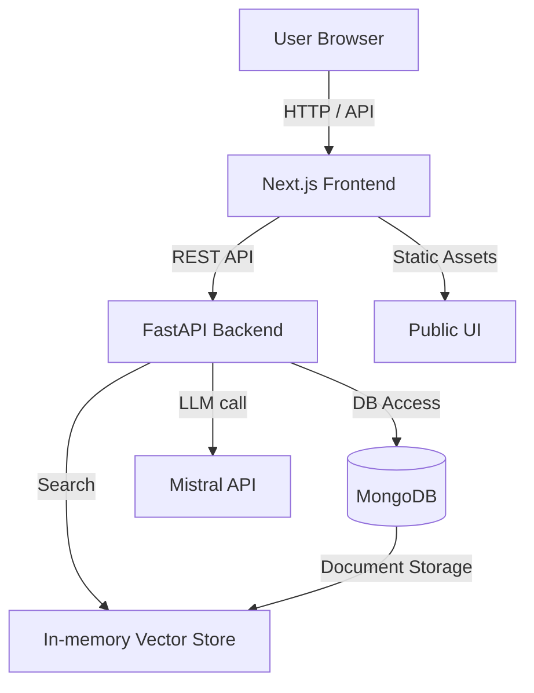
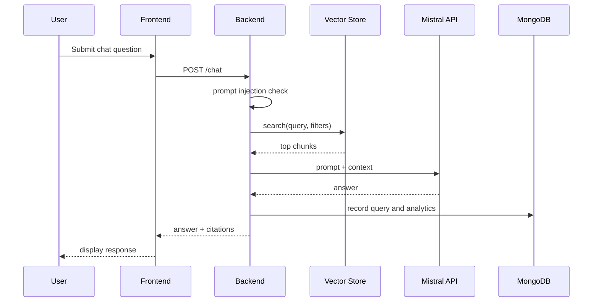

# System Architecture

## High-Level Architecture

The solution is structured into three main layers:

- Frontend
- Backend API
- Storage and Model Gateway

### Frontend

- Built with Next.js 15 and React 19
- Provides authentication, document management, chat, analytics, and admin pages
- Communicates with the backend through REST API endpoints

### Backend API

- FastAPI service exposing versioned routes under `backend/app/api/v1`
- Authenticates requests and enforces RBAC
- Coordinates retrieval, LLM calls, and audit logging

### Storage

- MongoDB stores user records, documents, queries, feedback, analytics, and security logs
- A simple in-memory vector store is used for semantic search over ingested chunks

## Component Diagram

## Data Flow

1. A user logs in or registers via the frontend.
2. The frontend sends a request to the backend authentication endpoints.
3. Authorized users upload or manage documents.
4. Document content is chunked and stored in the vector search store.
5. A chat request triggers semantic search and context retrieval.
6. The backend builds a prompt, calls Mistral, and returns the answer with citations.
7. Queries, token usage, and security events are recorded in MongoDB.

## Backend Data Components

- `users`: authentication, roles, and profile data
- `documents`: uploaded documents metadata and storage references
- `queries`: chat queries with answers, citations, and token metrics
- `feedback`: user feedback on responses
- `audit_logs`: system events and admin actions
- `security_logs`: prompt injection and security incident tracking

## Vector Store

The vector store in `backend/app/db/vector.py` currently uses an in-memory chunk list.

- Chunks are scored by word overlap with the query.
- Filters are applied by metadata keys.
- The top N chunks are included in the LLM context.

## Sequence Diagram

## Deployment Architecture

The project supports two deployment modes:

- Local development with `docker-compose.yml`
- Cloud deployment using `infra/render.yaml` for the backend and Vercel-ready frontend

### Render backend details

- `backend/runtime.txt` pins Python to version 3.13
- The service uses the FastAPI backend and MongoDB connection strings
- Environment variables are managed through Render secrets

## Security and Reliability

- Backend verifies prompt safety before any vector search or model call.
- Audit and security logs capture suspicious user actions.
- Token usage and latency metrics support cost monitoring.

## Future Architecture Improvements

- Replace the in-memory vector store with a dedicated vector database
- Add caching for frequently accessed document content
- Introduce streaming responses and conversation state persistence
