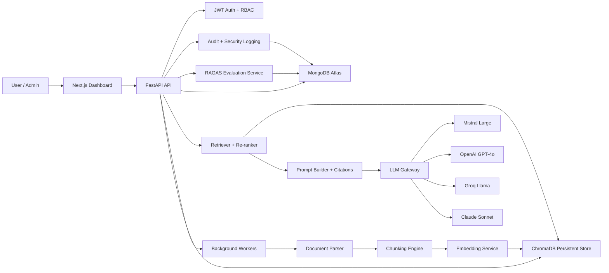
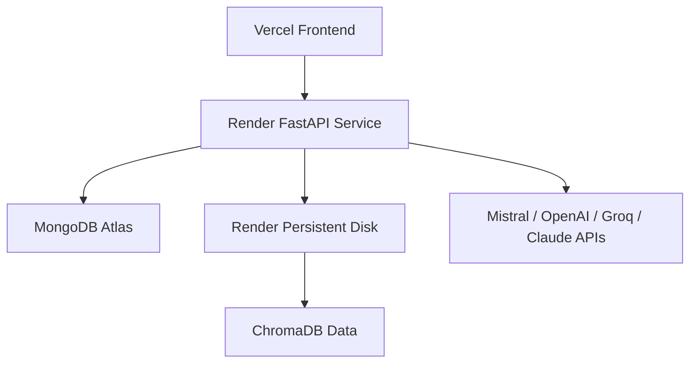

# Enterprise RAG Platform Architecture

## Implementation Decisions

The platform is split into a FastAPI backend and a Next.js dashboard. The backend owns security, ingestion, retrieval, evaluation, audit trails, and provider abstraction. The frontend is a SaaS-style control plane for admins and a chat workspace for users.

MongoDB Atlas is the system of record for users, roles, documents, chunks, conversations, feedback, evaluations, audit logs, security logs, and analytics snapshots. ChromaDB stores document embeddings and chunk metadata for semantic retrieval. LLM providers are isolated behind a provider gateway. Mistral is the primary provider, while OpenAI, Groq, and Claude can be enabled as optional fallbacks and tracked consistently.

The code follows a modular service layout:

- `api`: HTTP route boundaries and request/response mapping.
- `core`: settings, security, permissions, logging, and shared exceptions.
- `db`: Mongo and vector database clients.
- `models`: persistence models.
- `schemas`: validated API contracts.
- `services`: business workflows such as auth, ingestion, retrieval, RAG, evaluation, analytics, and audit.
- `workers`: background ingestion and evaluation tasks.

## System Architecture Diagram

## Request Flow

1. A user authenticates and receives an access token plus refresh token.
2. RBAC checks are applied at the route level using role permissions.
3. Uploaded files are validated, stored, parsed, cleaned, chunked, embedded, and indexed.
4. Chat queries pass through input validation and prompt-injection screening.
5. Retrieval fetches candidate chunks from ChromaDB, applies metadata filters, and builds cited context.
6. The selected LLM generates an answer with source citations.
7. Query, latency, token, cost, feedback, and audit events are stored for analytics and evaluation.

## Deployment Architecture

