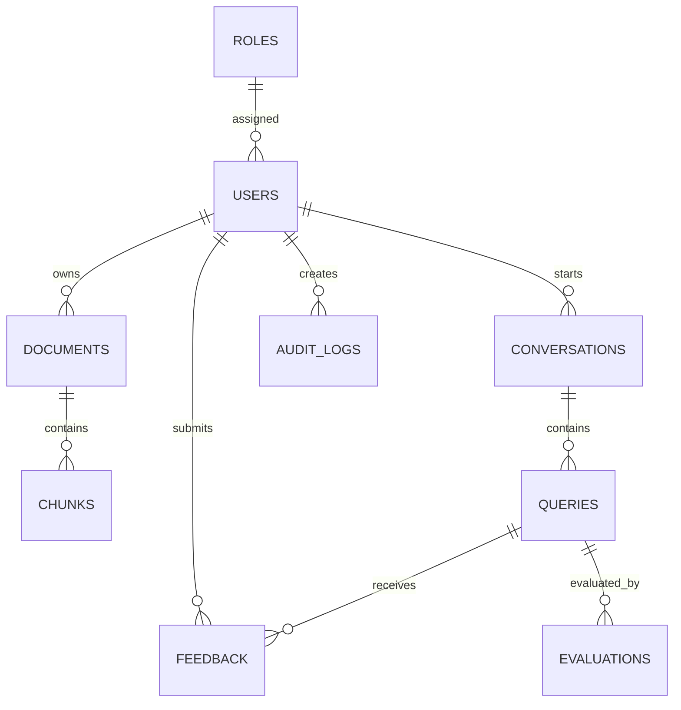

# Database Schema

## Collections

## Users

- `_id`
- `email`
- `hashed_password`
- `full_name`
- `role`
- `department`
- `is_active`
- `created_at`
- `updated_at`
- `last_login_at`

## Roles

- `_id`
- `name`
- `permissions`
- `created_at`
- `updated_at`

## Documents

- `_id`
- `filename`
- `content_type`
- `owner_id`
- `department`
- `category`
- `tags`
- `version`
- `size_bytes`
- `status`
- `storage_path`
- `created_at`
- `updated_at`

## Chunks

- `_id`
- `document_id`
- `chunk_index`
- `text`
- `metadata`
- `embedding_id`
- `created_at`

## Conversations

- `_id`
- `user_id`
- `title`
- `model`
- `created_at`
- `updated_at`

## Queries

- `_id`
- `conversation_id`
- `user_id`
- `question`
- `answer`
- `citations`
- `retrieved_chunks`
- `model`
- `latency_ms`
- `token_usage`
- `cost_estimate`
- `created_at`

## Evaluations

- `_id`
- `query_id`
- `faithfulness`
- `context_precision`
- `context_recall`
- `answer_relevancy`
- `hallucination_risk`
- `retrieval_quality`
- `created_at`

## Feedback

- `_id`
- `query_id`
- `user_id`
- `rating`
- `category`
- `comment`
- `created_at`

## AuditLogs

- `_id`
- `actor_id`
- `action`
- `resource_type`
- `resource_id`
- `metadata`
- `ip_address`
- `created_at`

## SecurityLogs

- `_id`
- `actor_id`
- `event_type`
- `severity`
- `details`
- `ip_address`
- `created_at`

## Analytics

- `_id`
- `snapshot_date`
- `system_metrics`
- `rag_metrics`
- `llm_metrics`
- `created_at`

